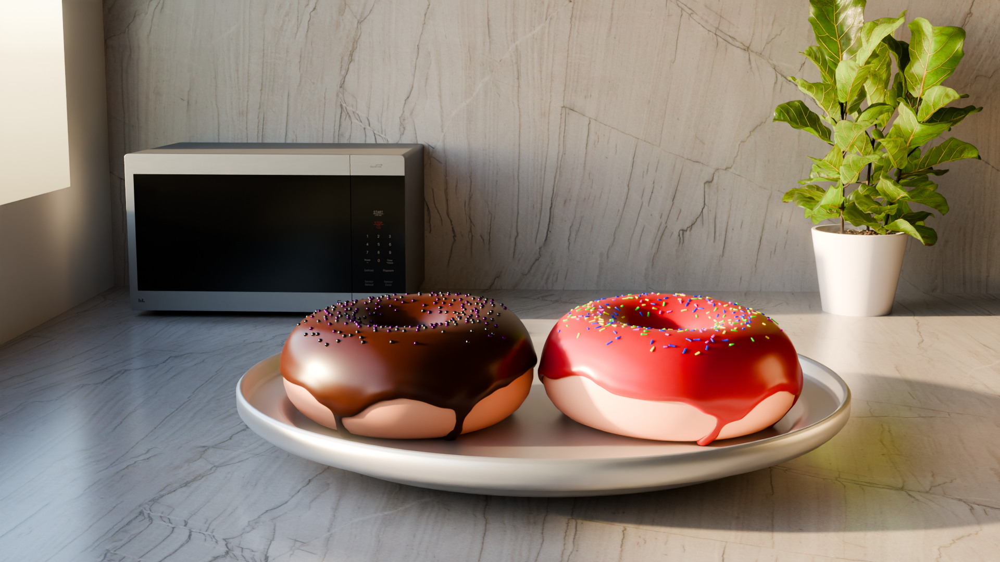
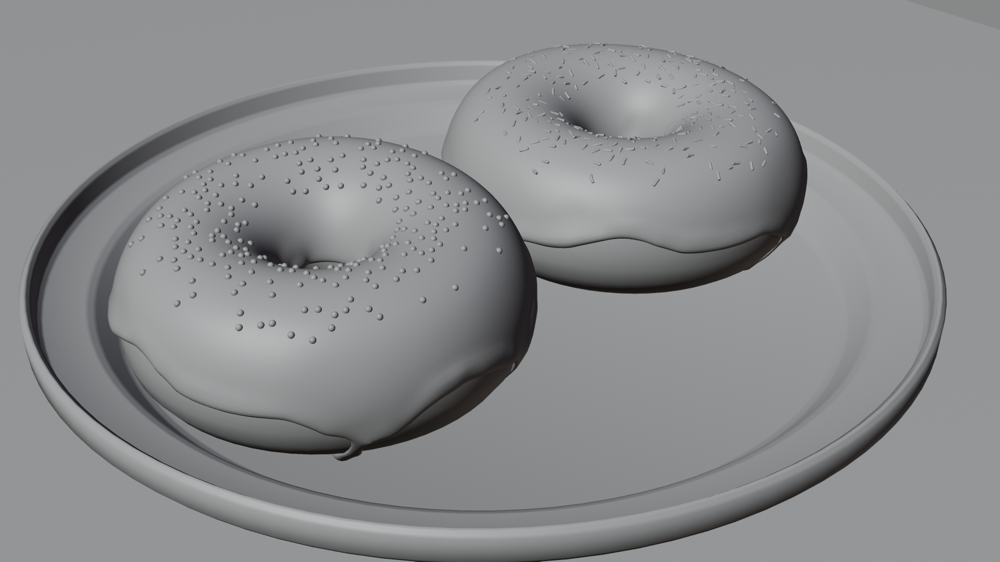
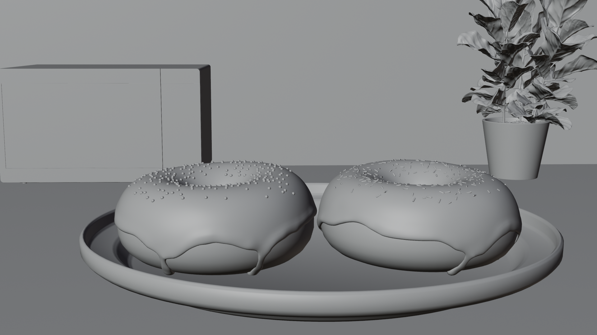
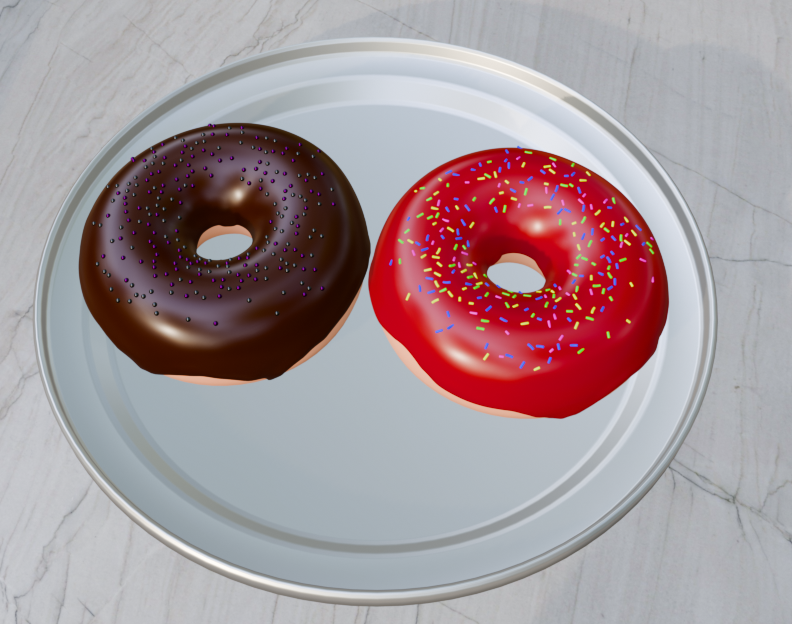

# Donut Blender Design

This is my first and definitely not last blender project, had a blast learning it and I can proudly say that it turned out way better than I expected.

The creative process behind this project was to learn on how to create 3D models to use in Unreal Engine.

The process behind the creation of these meshes was an interesting one, so much interesting that I prefer to simply show you instead of writing.

The textures used to create the donuts were pretty simple, as I wanted to relive my childhood and recreate one of the best donuts I have ever ate.

